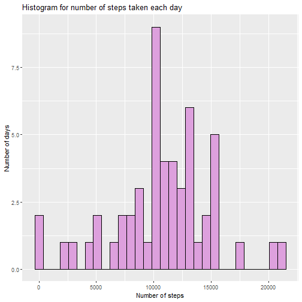
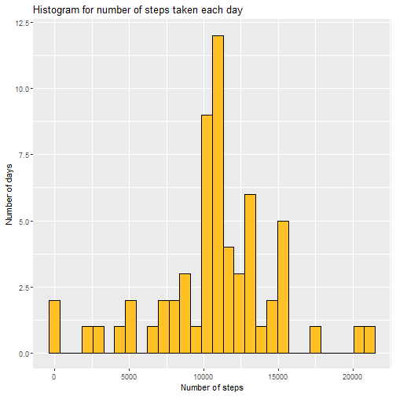
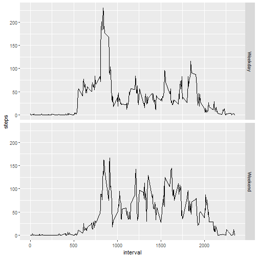

Week 2 Assignment 
===================================
### by: Samyak Shah, IIT Bombay  
#### Code for reading in the dataset and/or processing the data
The file has been downloaded and unzipped.  

```r
setwd("C:/Users/Samyak/Desktop/Academics/Coursera/Data_Science_JHU_5/Week_2")
data<-read.csv("activity.csv", header=TRUE)
head(data)
```

```
##   steps       date interval
## 1    NA 2012-10-01        0
## 2    NA 2012-10-01        5
## 3    NA 2012-10-01       10
## 4    NA 2012-10-01       15
## 5    NA 2012-10-01       20
## 6    NA 2012-10-01       25
```

```r
summary(data)
```

```
##      steps                date          interval     
##  Min.   :  0.00   2012-10-01:  288   Min.   :   0.0  
##  1st Qu.:  0.00   2012-10-02:  288   1st Qu.: 588.8  
##  Median :  0.00   2012-10-03:  288   Median :1177.5  
##  Mean   : 37.38   2012-10-04:  288   Mean   :1177.5  
##  3rd Qu.: 12.00   2012-10-05:  288   3rd Qu.:1766.2  
##  Max.   :806.00   2012-10-06:  288   Max.   :2355.0  
##  NA's   :2304     (Other)   :15840
```
Creating a new variable by omitting the missing values

```r
data.complete<-na.omit(data)
```
#### Histogram of the total number of steps taken each day

```r
library(dplyr)
```

```
## 
## Attaching package: 'dplyr'
```

```
## The following objects are masked from 'package:stats':
## 
##     filter, lag
```

```
## The following objects are masked from 'package:base':
## 
##     intersect, setdiff, setequal, union
```

```r
data.date<-data.complete %>% group_by(date) %>% summarize(steps=sum(steps))
summary(data.date)
```

```
##          date        steps      
##  2012-10-02: 1   Min.   :   41  
##  2012-10-03: 1   1st Qu.: 8841  
##  2012-10-04: 1   Median :10765  
##  2012-10-05: 1   Mean   :10766  
##  2012-10-06: 1   3rd Qu.:13294  
##  2012-10-07: 1   Max.   :21194  
##  (Other)   :47
```

```r
library(ggplot2)
qplot(steps, data=data.date, xlab= "Number of steps",ylab="Number of days", main="Histogram for number of steps taken each day", fill=I("plum"),colour=I("black"))
```

```
## `stat_bin()` using `bins = 30`. Pick better value with `binwidth`.
```



```r
dev.off()
```

```
## null device 
##           1
```
#### Mean and median number of steps taken each day  

```r
mean(data.date$steps)
```

```
## [1] 10766.19
```

```r
median(data.date$steps)
```

```
## [1] 10765
```
#### Time series plot of the average number of steps taken

```r
data.int<-data.complete %>% group_by(interval) %>% summarize(steps=mean(steps))
ggplot(data.int, aes(interval, steps)) + geom_line()
```


```r
dev.off()
```

```
## null device 
##           1
```
#### The 5-minute interval that, on average, contains the maximum number of steps

```r
data.int[which.max(data.int$steps),]
```

```
## # A tibble: 1 x 2
##   interval steps
##      <int> <dbl>
## 1      835  206.
```
#### Code to describe and show a strategy for imputing missing data

```r
missing<-nrow(data)-nrow(data.complete)
```
The number of rows with missing values are 2304.  
Some days have no data, so it is not feasible to replace missing values with the day’s mean.

```r
names(data.int)[2] <- "mean.steps"
data.imputed <- merge(data, data.int)
names(data)
```

```
## [1] "steps"    "date"     "interval"
```

```r
names(data.int)
```

```
## [1] "interval"   "mean.steps"
```

```r
names(data.imputed)
```

```
## [1] "interval"   "steps"      "date"       "mean.steps"
```
We observe that interval column has been used for merging. The last column gives the mean steps for a particular interval calculated over all days.  
If steps is NA, we replace the value with the mean number of steps for the interval

```r
data.imputed$steps[is.na(data.imputed$steps)] <- data.imputed$mean.steps[is.na(data.imputed$steps)]
summary(data.imputed)
```

```
##     interval          steps                date         mean.steps     
##  Min.   :   0.0   Min.   :  0.00   2012-10-01:  288   Min.   :  0.000  
##  1st Qu.: 588.8   1st Qu.:  0.00   2012-10-02:  288   1st Qu.:  2.486  
##  Median :1177.5   Median :  0.00   2012-10-03:  288   Median : 34.113  
##  Mean   :1177.5   Mean   : 37.38   2012-10-04:  288   Mean   : 37.383  
##  3rd Qu.:1766.2   3rd Qu.: 27.00   2012-10-05:  288   3rd Qu.: 52.835  
##  Max.   :2355.0   Max.   :806.00   2012-10-06:  288   Max.   :206.170  
##                                    (Other)   :15840
```
#### Histogram of the total number of steps taken each day after missing values are imputed  

```r
data.day.imputed <- data.imputed %>% group_by(date) %>% summarize(steps=sum(steps))
qplot(steps, data=data.day.imputed, xlab= "Number of steps",ylab="Number of days", main="Histogram for number of steps taken each day", fill=I("goldenrod1"),colour=I("black"))
```

```
## `stat_bin()` using `bins = 30`. Pick better value with `binwidth`.
```



```r
dev.off()
```

```
## null device 
##           1
```
#### Panel plot comparing the average number of steps taken per 5-minute interval across weekdays and weekends  

```r
data.imputed$dayofweek <- weekdays(as.Date(data.imputed$date))
data.imputed$weekend <-as.factor(data.imputed$dayofweek=="Saturday"|data.imputed$dayofweek=="Sunday")
levels(data.imputed$weekend) <- c("Weekday", "Weekend")

data.weekday <- data.imputed[data.imputed$weekend=="Weekday",]
data.weekend <- data.imputed[data.imputed$weekend=="Weekend",]

data.int.weekday <- data.weekday %>% group_by(interval) %>% summarize(steps=mean(steps))
data.int.weekday$weekend <- "Weekday"
data.int.weekend <- data.weekend %>% group_by(interval) %>% summarize(steps=mean(steps))
data.int.weekend$weekend <- "Weekend"

data.int <- rbind(data.int.weekday, data.int.weekend)
data.int$weekend <- as.factor(data.int$weekend)
ggplot(data.int, aes(interval, steps)) + geom_line() + facet_grid(weekend ~ .)
```


